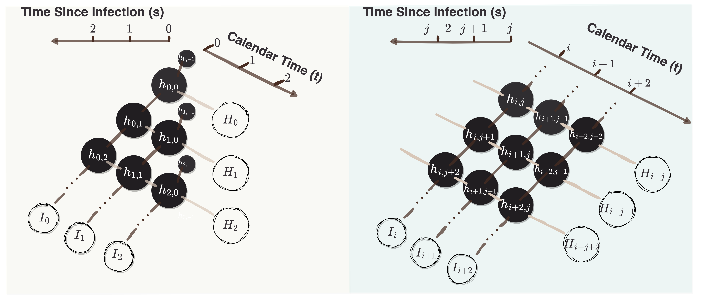

Code of the Paper: Time-Since-Infection Model for Hospitalization and Incidence Data
==============================================
  
  
## Outline
1. Description
2. Sudo Algorithm
3. Package requirements
4. Code for Simulation 
5. Code for Real Data
6. How to run the Algorithm on your data?
  
## Description
This README is prepared for journal peer review of the "Time-Since-Infection Model for Hospitalization and Incidence Data" paper. 

The proposed MCEM algorithm is proposed for simultaneously estimating the instantaneous reproduction number, and the generation time (infectiousness profile and hospitalization profile) of a transmission disease that meets the basic assumptions of the time-since-infection model with daily incident cases, covariates data, and hospitalization data. It allows the time-since-infection model to incorporate hospitalization data when complicated data structures are involved.

## Data structure (Figure 2)

## Package Requirements
- A database with clear and consistent variable names
- R version: R (>= 4.0.2)
- On Windows: download and install [mvtnorm](https://CRAN.R-project.org/package=mvtnorm), [EpiEstim](https://CRAN.R-project.org/package=EpiEstim), [mc2d](https://CRAN.R-project.org/package=mc2d), [ggplot2](https://CRAN.R-project.org/package=ggplot2), [nlme](https://CRAN.R-project.org/package=nlme), [numDeriv](https://CRAN.R-project.org/package=numDeriv), [TTR](https://CRAN.R-project.org/package=TTR), [parallel](https://CRAN.R-project.org/package=parallel), [dplyr](https://CRAN.R-project.org/package=dplyr)
## Run QSOEID example with code

##  Code for Simulation 
Code for simulation can be find the file "R Code" and "sampled data"

##  Code for Real Data
Code for simulation can be find the file "Covid_code_real_data_organize", where the precleaned data contains data of four metropolitans, 
  #Miami-Dade 12086
  #Wayne MI 26163
  #NYC NY 36061
  #COOK IL 17031

## How to run QSOEID on your data?

* Get the data ready, which requires no missing values and clear variable names. 
* Set the tunning parameters `NoCov, T, R_0, I_0` so the model is specified. The input data includes covariates Z, being a (T \times NoCov) matrix, incident cases I, hospitalization H, both being a (1 \times T) matrix. 
